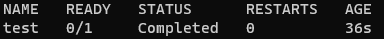
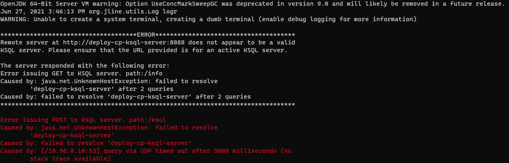

# KSQL not failing container on exception

The purpose od this repo is to demonstrate that ksql cli does not fail a container in k8s when an exception is rised.
This prevents k8s from restarting the container in the case of a failure due to the ksql server not being ready yet.


### Report:
**Describe the bug**
A k8s container with the ksqsl cli that fails to connect to
the ksqsl server does not fail the container. This is issue evne thouhg is reproduced through a k8s pod seems to be caused by the bash scripts.

**To Reproduce**
Steps to reproduce the behavior, include:
1. Version: confluentinc/ksqldb-cli:0.17.0
2. Demo repo: https://github.com/javiersvg/ksql-bug-demo
3. Commands:
```
kubectl create namespace test-env
kubectl -n test-env apply -f test.yaml
kubectl -n test-env get po
```

**Expected behavior**
The created container should fail to connect to the server and the ```get po``` command should show the container as ```Error```.

**Actual behaviour**
The ```get po``` command shows the container as ```Completed``` instead.

A clear and concise description of what actually happens, including:
1. After running ```get po``` the container is ```Compelted```
- 
2. KSQL logs show that the client was unable to connect to the sesrver
- 

**Additional context**
I have been looking at some posible solutions but had no success this far.
The problem affects k8s deployment but should be caused by the bash scripts: [ksqsl](https://github.com/confluentinc/ksql/blob/master/bin/ksql) and [kssql-run-class](https://github.com/confluentinc/ksql/blob/master/bin/ksql-run-class)
